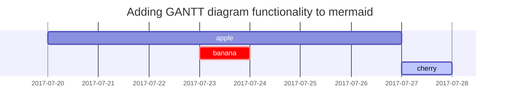

## Headings[](https://chirpy.cotes.page/posts/text-and-typography/#headings)

# H1 — heading

## H2 — heading

### H3 — heading

#### H4 — heading

## Paragraph[](https://chirpy.cotes.page/posts/text-and-typography/#paragraph)

Quisque egestas convallis ipsum, ut sollicitudin risus tincidunt a. Maecenas interdum malesuada egestas. Duis consectetur porta risus, sit amet vulputate urna facilisis ac. Phasellus semper dui non purus ultrices sodales. Aliquam ante lorem, ornare a feugiat ac, finibus nec mauris. Vivamus ut tristique nisi. Sed vel leo vulputate, efficitur risus non, posuere mi. Nullam tincidunt bibendum rutrum. Proin commodo ornare sapien. Vivamus interdum diam sed sapien blandit, sit amet aliquam risus mattis. Nullam arcu turpis, mollis quis laoreet at, placerat id nibh. Suspendisse venenatis eros eros.

## Lists[](https://chirpy.cotes.page/posts/text-and-typography/#lists)

### Ordered list[](https://chirpy.cotes.page/posts/text-and-typography/#ordered-list)

1. Firstly
2. Secondly
3. Thirdly

### Unordered list[](https://chirpy.cotes.page/posts/text-and-typography/#unordered-list)

- Chapter
    - Section
        - Paragraph

### ToDo list[](https://chirpy.cotes.page/posts/text-and-typography/#todo-list)

- [ ] Job
    - [x] Step 1
    - [x] Step 2
    - [ ] Step 3

### Description list[](https://chirpy.cotes.page/posts/text-and-typography/#description-list)

Sun
:the star around which the earth orbits
Moon
:the natural satellite of the earth, visible by reflected light from the sun

## Block Quote[](https://chirpy.cotes.page/posts/text-and-typography/#block-quote)

> This line shows the _block quote_.

## Prompts[](https://chirpy.cotes.page/posts/text-and-typography/#prompts)

## Prompts

> An example showing the `tip` type prompt.

{: .prompt-tip }

> An example showing the `info` type prompt.

{: .prompt-info }

> An example showing the `warning` type prompt.

{: .prompt-warning }

> An example showing the `danger` type prompt.

## Tables

| Contact          | Company                      | Country |
| ---------------- | ---------------------------- | ------- |
| Maria Anders     | Alfreds Futterkiste          | Germany |
| Helen Bennett    | Island Trading               | UK      |
| Giovanni Rovelli | Magazzini Alimentari Riuniti | Italy   |
|                  |                              |         |


## Links

<http://127.0.0.1:4000>

| dsadasd | dasda |
| ------- | ----- |
| dasd    | addas |

## Code blocks

### Common

```text
This is a common code snippet, without syntax highlight and line number.
```

### Specific Language

```bash
if [ $? -ne 0 ]; then
  echo "The command was not successful.";
  #do the needful / exit
fi;
```


## Mathematics

The mathematics powered by [**MathJax**](https://www.mathjax.org/):

$$
\begin{equation}
  \sum_{n=1}^\infty 1/n^2 = \frac{\pi^2}{6}
  \label{eq:series}
\end{equation}
$$


We can reference the equation as \eqref{eq:series}.

When $a \ne 0$, there are two solutions to $ax^2 + bx + c = 0$ and they are

$$ x = {-b \pm \sqrt{b^2-4ac} \over 2a} $$

## Mermaid SVG




## Images


## Video



