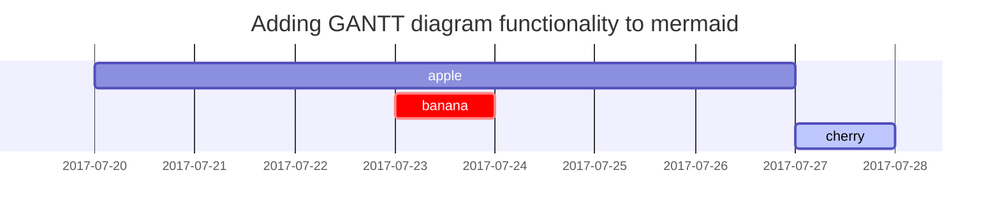

Formatações prontas para copiar


## Prompts


```
{: .prompt-tip }
```

```
{: .prompt-info }
```

```
{: .prompt-warning }
```

```
{: .prompt-danger }
```

## Mathematics


The mathematics powered by [**MathJax**](https://www.mathjax.org/):
```

$$
\begin{equation}
  \sum_{n=1}^\infty 1/n^2 = \frac{\pi^2}{6}
  \label{eq:series}
\end{equation}
$$


We can reference the equation as \eqref{eq:series}.

When $a \ne 0$, there are two solutions to $ax^2 + bx + c = 0$ and they are

$$ x = {-b \pm \sqrt{b^2-4ac} \over 2a} $$

## Mermaid SVG




## Images

```
" alt="img">
```

## Video

```

```

No link, entre = e & 

```
em https://www.youtube.com/watch?v=zCnEA2uSC0g&t=412s

ID seria 'zCnEA2uSC0g'
```


